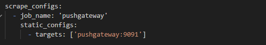

# 📉 Pull vs Push / Service Discovery

> 📅 Terça-feira – 20% da prova PCA  
> Este conteúdo cobre o domínio: **Prometheus Fundamentals**

---

## 🎯 Objetivos

- Compreender como o Prometheus coleta dados de serviços monitorados.
- Entender a diferença entre os modelos **Pull** e **Push**.
- Aprender como funciona o **Service Discovery** no Prometheus.
- Entender como funcionam **targets** e **labels**.

---

## 🔄 Pull vs Push

### 📥 Pull (Modelo nativo do Prometheus)

O Prometheus coleta dados ativamente das aplicações, enviando requisições HTTP para um endpoint de métricas (geralmente `/metrics`).

✅ **Vantagens**:
- Controle total da coleta.
- Mais seguro (o Prometheus inicia a conexão).
- Fácil de depurar.

❌ **Desvantagens**:
- Não funciona bem com serviços por trás de firewalls/NAT sem configurações adicionais.

### Exemplo de Pull
Prometheus faz requisições GET para:

http://app1:9100/metrics
http://api:8080/metrics
Você precisa configurar isso no prometheus.yml:

scrape_configs:
  - job_name: 'api'
    static_configs:
      - targets: ['api:8080']

### 📤 Push (usando Pushgateway)

O Prometheus não suporta push direto, mas existe o Pushgateway para casos especiais (ex: jobs curtos ou batch que não têm tempo de vida longo).

### 📌 Exemplo:

echo "my_custom_metric 42" | curl --data-binary @- http://pushgateway:9091/metrics/job/my_job

No Prometheus:

⚠️ Use com moderação! Não é ideal para serviços que estão sempre ativos.
### 🔎 Service Discovery

O Service Discovery permite que o Prometheus descubra automaticamente os endpoints a serem monitorados.

#### 🔧 Tipos suportados

    - Static Config (fixo no prometheus.yml)
    - Kubernetes
    - Consul
    - EC2, Azure, GCE, DigitalOcean
    - DNS SRV

Exemplo: Discovery com Kubernetes

Esse exemplo descobre os nós do cluster Kubernetes e redireciona o scrape para a porta 9100 (onde normalmente roda o node_exporter).
### 🎯 Targets e Labels
##### Targets

Um target é qualquer endpoint HTTP exposto com métricas.

### 🔍 Exemplo:

targets: ['my-app:9000', 'auth-service:9100']
 O Prometheus coleta periodicamente (a cada 15s por padrão).

##### Labels
Os labels são pares chave-valor que acompanham as métricas.
 💡 Eles ajudam a filtrar, agrupar e agregar dados em PromQL.
 🔧 Exemplo de métrica exposta:

`http_requests_total{job="api", instance="api:8080", method="GET", status="200"} 129`

### 📚 Resumo Visual

Conceito	Explicação rápida
- Pull	Prometheus coleta das aplicações (padrão).
- Push	Aplicações enviam para o Pushgateway (casos especiais).
- Service Discovery	Descoberta automática dos endpoints para scrape.
- Target	Endereço de onde o Prometheus coleta métricas.
- Label	Informações adicionais que descrevem as métricas coletadas.

### 🧪 Exercício sugerido

    Crie um prometheus.yml com:
    Um job com static_configs de duas aplicações.
    Um job com discovery Kubernetes (se usar k8s).
    Simule um push com o Pushgateway e visualize no Prometheus.

##### 🚩 Parte 1: Pull vs Push

1. No modelo de coleta do Prometheus, qual é o método padrão: Pull ou Push? Explique por quê.
2. Em que situação seria mais adequado usar um Push Gateway com Prometheus?
3. Quais as vantagens do modelo Pull em relação ao Push para observabilidade?
4. Por que o Prometheus não é ideal para monitorar métricas que vêm de dispositivos que aparecem e somem rapidamente, como jobs curtos? Qual a alternativa nesses casos?
##### 🚩 Parte 2: Service Discovery

5. Para que serve o Service Discovery no Prometheus?
6. Quais são algumas das plataformas e serviços que o Prometheus suporta nativamente para Service Discovery?
7. Explique o que é um "target" no contexto do Service Discovery e Prometheus.
8. O que acontece se o Prometheus parar de encontrar um target via Service Discovery?
9. É possível usar Service Discovery com configurações estáticas? Como?

### 📘 Leitura complementar

[Prometheus - Getting started('https://prometheus.io/docs/prometheus/latest/getting_started/')]
[Scraping from Pushgateway('https://prometheus.io/docs/practices/pushing/')]
[Service Discovery documentation('https://prometheus.io/docs/prometheus/latest/configuration/configuration/#service_discovery_config')]
✨ Próximo tópico: 📊 PromQL – Parte 1

---